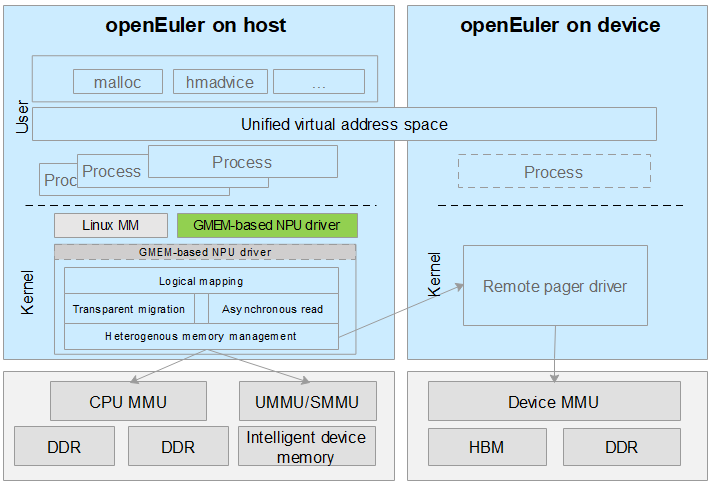

# Introduction to GMEM

## Introduction

Memory management on the CPU side is separated from that on the heterogeneous accelerator side. Explicit data migration makes it difficult to balance usability and performance. The high bandwidth memory (HBM) of heterogeneous accelerators is generally insufficient for large language models, and manual swap causes a large performance loss and applies only to dedicated scenarios. A large number of invalid data migrations occur in search & recommendation and big data scenarios, and no efficient memory pooling solution is available. The Heterogeneous Memory Management (HMM) feature of Linux is confronted with complicated programming, unsatisfying performance, and poor portability, and depends greatly on manual tuning. As a result, OS communities are not willing to use HMM. An efficient memory management solution is needed to address the preceding issues on heterogeneous accelerators.

Generalized Memory Management (GMEM) provides centralized management for heterogeneous memory interconnection. The GMEM APIs allow devices to connect to a unified address space and obtains programming optimization for heterogeneous memory, separating CPU architecture-related implementations from the memory management system of Linux.

After the memory of the CPU and accelerator is encapsulated into a unified virtual address space, developers do not need to manually migrate the memory between two parallel address spaces. Instead, they only need to use a unified set of application and release functions. The dynamic random access memory (DRAM) of the CPU can even serve as the cache of the accelerator without much overhead.

## Architecture

 

## Application Scenarios

Foundation model training and inference

* GMEM implements transparent heterogeneous memory capacity expansion and automatic HBM overcommitment, enabling high-performance and low-threshold training and inference.
* GMEM provides OS-native simplified heterogeneous memory management. With memory overcommitment, the performance of foundation model training is 60% higher than that of NVIDIA.

Large memory sharing

* GMEM provides flexible policies for remote access and on-demand memory migration to eliminate memory migration bottlenecks and improve end-to-end performance of search & recommendation and big data applications.

## Functions

For driver developers, GMEM provides unified function registration interfaces to reduce repeated work and the size of memory management code and avoid additional vulnerabilities. 

* Interfaces provided by GMEM can simplify the code for the driver to access the physical memory.
* The unified interfaces help avoid vulnerabilities when the driver developer implements the same function repeatedly.

For users, GMEM provides stronger programmability for AI model and machine learning framework development using accelerators. You do not need to manually manage the data storage location.

* Memory of the CPU and the accelerator can be accessed through unified memory application and release functions.
* Addresses of both CPU memory and accelerator memory can be mapped to the same virtual address space.
* GMEM encapsulates memory management code, improving the management performance.
