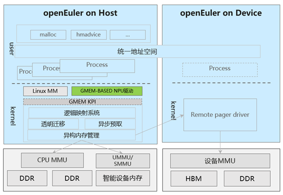

# 认识GMEM

## 简介

当前异构侧数据管理CPU与异构侧分离，数据显式搬移，易用性和性能难以平衡：异构设备HBM内存严重不足，应用手动SWAP方案性能损耗大且通用性差；搜推、大数据场景存在大量无效数据搬移，缺少高效内存池化方案，急需统一的有效对等内存管理机制，Linux现有HMM框架搁浅，编程复杂度高且依赖人工调优，NV、AMD虽尝试接入，但由于架构问题导致代码缺乏通用性，性能可移植性差，引起上游OS社区反弹。

GMEM (Generalized Memory Management) 提供了异构互联内存的中心化管理，GMEM API支持设备接入统一地址空间，获得针对异构内存编程的优化，将CPU架构相关的实现从Linux的内存管理系统中独立出来。

当CPU和加速卡的内存被封装到一个统一的虚拟地址空间中后，开发者们就不再需要在两个并行的地址空间中手动转移内存，只需要使用一套统一的申请释放函数。在这种模式下甚至可以选择将CPU的DRAM内存作为加速卡的cache，代码开销也不会过大。

## 架构

  

## 应用场景

大模型训推场景

* GMEM实现异构内存透明扩容技术，实现HBM内存自动超分，实现高性能、低门槛训推。
* 提供OS原生的极简异构内存管理，超分大模型性能相比NVIDIA性能提升60%。

大内存共享场景

* 提供远程访问与按需搬移内存的灵活策略，解决内存搬移瓶颈，提升搜推、大数据应用端到端性能。

## 功能描述

驱动开发侧，GMEM提供了统一的函数注册接口，让驱动开发者避免反复造相同的轮子，确保内存管理代码不再爆炸式地增长，也规避了额外的漏洞。

* 调用GMEM提供的接口，简化驱动使用物理内存的代码。
* 驱动使用GMEM统一提供的接口，避免自行造轮子时出现漏洞。

加速卡用户侧，GMEM给使用加速卡进行AI模型及机器学习框架开发提供了更强的可编程性：不再需要手动管理数据是存放在加速卡上还是CPU上。

* 通过统一的内存申请释放函数与CPU及卡上的内存交互。
* 同一虚拟地址空间中既可以映射到CPU上，也可以映射到加速卡上。
* GMEM封装内存管理代码，相比手动管理获得性能提升。
